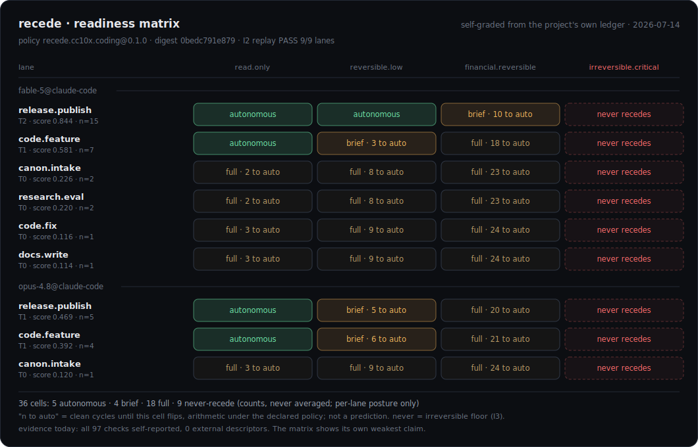

# Recede

**Trust is a trajectory, not a checkpoint.** Recede is an open protocol that decides, with receipts, when an agent's work still needs human review. It does not review code or predict quality; it makes the review-skipping teams already do under delivery pressure explicit and auditable. Every decision is a pure function over a hash-linked evidence chain, scoped per `(Actor, TaskType)`, earned slowly and lost fast, with hard floors on irreversible actions. Review recedes where your declared policy says the receipts have earned it, never because a score says so, and snaps back the instant quality regresses.

> Status: **v0.1 DRAFT**. The protocol is the deliverable; the reference code is proof. Breaking changes expected before 1.0. Apache-2.0 © 2026 Yuval Raz.

## The landscape, live

This is Recede grading its own development. Rows are `(actor, task_type)` trust lanes from the project's real ledger; columns are risk classes. Green means review has receded there. Amber cells state their distance: n clean cycles to autonomous, arithmetic under the declared policy, not a prediction. The right column never goes green at any trust tier (invariant I3).



One command produces this landscape for any ledger: `recede-cc10x matrix --ledger <path>`. It emits a frozen `recede-readiness/1` JSON (this render's snapshot: [assets/readiness-2026-07-14.json](assets/readiness-2026-07-14.json)) and a markdown view. There is no aggregate readiness score, by design; averaging lanes is how trust gets mis-attributed in the first place. The guided path from zero to this view is [`skills/recede-path`](./skills/recede-path/SKILL.md).

---

## The problem: review fatigue

The question every engineering team is now asking is whether an AI reviewer is finally good enough to push a PR to production without a human. It is the wrong question. Put an AI agent on consequential work (code, support replies, refunds, document intake) and a human is nominally reviewing it. Nobody can review everything an agent does at agent speed, so review collapses into rubber-stamping (theater) or bottlenecking (the agent's speed is wasted). Engineering teams feel it first: nobody reads dozens of agent PRs a day. The useful problem is narrower: knowing where review can safely recede, and where it never can. Recede starts there and reaches further.

The root cause is a trust-calibration bug. Trust in an agent today is **mis-attributed**: one global "do I trust the AI?" verdict, when *trusted to fix a flaky test* and *trusted to run a schema migration* are different questions, and neither says anything about *trusted to answer a customer*. And it is **mis-calibrated**: granted or withheld by feeling, not evidence. The usual answer is a bigger dashboard, a 0-1000 score, more alerts. More to watch. The payoff of earned trust should be that review disappears where it is no longer warranted, and snaps back the instant quality regresses.

## How you adopt it

**Wrap one function.** A verified, validated change is a small trust win, held per `(Actor, TaskType)`. Wins compound on `code.fix` until, under a policy you declared, the human checkpoint on low-risk fixes recedes, while `code.migrate` still stops for a human every time. Nobody edits a rule at that moment; the receipts crossed the bar your policy set, and a regression drops them back below it just as fast.

## The model in five bullets

1. **Trust is scoped.** Held per `(Actor, TaskType)`, never one global agent score. Trusted on `code.fix` ≠ trusted on `code.migrate`. Review recedes in one lane while staying tight in another.
2. **Every action emits a Warrant.** An append-only, hash-linked evidence chain: *intent → change → checks → outcome*. Trust is a sum over receipts you can open. No Warrant, no trust movement.
3. **V&V is first-class and split.** **Verify** = the technical contract holds (CI, tests, types). **Validate** = the product contract holds (the change delivers what the ticket and the product intent actually asked, at quality). Trust is only ever as trustworthy as the product context you measure Validate against. Conflating "tests are green" with "it did what I asked" is how confidently-wrong code merges.
4. **The Gate is a pure function.** `gate(trust, risk, policy) → checkpoint | autonomous`. Same inputs, same decision, always replayable. That makes "review recedes as trust is earned" a provable property.
5. **Trust is asymmetric and bounded.** Earned slowly, lost fast. It decays with staleness and with drift: as the system changes, trust in work built on a contract falls until the contract is re-satisfied, so review re-arms exactly where drift grows. Irreversible actions (migrations, prod deploys) keep a human checkpoint at *every* tier. Earned autonomy is bounded, never unbounded.

`replay()` over the stored Warrants reconstructs the exact trust state from receipts plus pinned policy, so "why did this merge unattended?" is answered by pointing at the chain.

## The pre-registered test

A protocol that grades agents has to accept the same grading, and Recede's own dogfooding ledger could not provide it: for weeks it held one actor's records with zero reverts, and a ledger that only ever says PASS carries no information (invariant I4 says exactly that). Real history has the reverts, so I ran a pre-registered test against it: could replayed lane trust, computed from evidence observable at merge time only, predict which merged PRs later reverted, better than trivial baselines?

> Before any result existed I froze the revert definition, the success thresholds, and the leakage rules, and committed to shipping the result either way. On 6,464 next.js PRs the current trust math did not beat trivial baselines; the 3,457 langchain PRs were underpowered and inconclusive. A post-hoc correction I made to an under-converged baseline is what flipped the first result against my own thesis. The pipelines are deterministic and the scorecards publish with the writeup. Nothing Recede delivers today depends on that predictive claim, and the discipline of the null is why you can trust the numbers it does publish.

Predicting which changes will revert is a roadmap capability, not a claim Recede makes today; adoption is what accrues the data a future iteration would need. What ships now is the governance gate itself: warrant chains, a pure replayable decision, asymmetric trust with hard never-recede floors, and a receipt for every action a human no longer reads.

## One protocol, many flows

Recede does not know what code is. The spec defines actors, task types, evidence, and a gate; the flow decides what Verify, Validate, and "irreversible" mean.

- **SDLC, the entry.** `code.fix` / `code.feature` / `code.migrate`; Verify = CI, tests, types; Validate = the change does what the ticket asked. Worked end to end in [`examples/sdlc`](./examples/sdlc) and the [CC10X adapter](./integrations/cc10x).
- **Refunds and commerce ops, the frontier.** Outcomes defer: a chargeback flips SUCCESS → REVERTED a day later and trust drops retroactively. Above a threshold, `never_recede`. Runnable in [`examples/refund`](./examples/refund); a mandate-carrying shopping agent rides the same protocol in [`examples/agentic-checkout`](./examples/agentic-checkout).
- **Conversational and support.** `reply.draft` and `reply.send` are different task types with different risk. Verify = grounding, citations, PII scrub; Validate = tone, policy, intent fit. Review recedes on routine intents, never on legal or medical paths.
- **Intake and document pipelines.** `doc.classify`, `doc.extract`; Verify = schema validity; Validate = sampled human ground truth. A new vendor format re-arms review by itself.

Same protocol, same receipts. Only the checks and the policy change.

## Why it's different

| Incumbent | What it does | Recede's distinct axis |
|---|---|---|
| Eval / observability tools | Score each run in isolation | **Trust has memory**, carried forward per capability |
| Static guardrails / control standards | Apply the same checkpoints uniformly, forever | **Review is proportional** to earned evidence |
| Governance promotion-ladders | Earned, but coarse HR-style tiers, calendar time, sign-off | **Continuous and machine-verifiable**, per action |
| Agent identity / A2A | Establish *who* the agent is | Tracks **what the agent has earned** |

Recede sits as a layer above interop protocols (MCP/A2A), eval tools, static guardrails, and framework validation loops (accessibility, SEO, type, and contract validators that already check every agent output), consuming their signals as evidence rather than replacing them. The checks you already run become the evidence, and Recede is the memory and the gate on top of them: it decides, per lane, when their green is enough to let review recede.

## Quickstart

> Reference implementation: TypeScript primary, Python mirror, in [`reference/`](./reference/). Wrapping CC10X or another harness? See [`INTEGRATIONS.md`](./INTEGRATIONS.md).

```ts
const r = new Recede({ ledger: new MemoryLedger(), checkpoint: consoleCheckpoint(), policy });

const ciGreen  = check.verify("ci", io => io.output.ci === "green");
const intentOK = check.validate("intent-fit", async io => ({ ok: await reviewMatchesIntent(io.intent, io.diff), confidence: 0.8 }));

const outcome = await r.run(() => agent.implement(ticket), {
  actor: "code-agent",
  taskType: "code.fix",
  intent: `Fix ${ticket.id}: ${ticket.title}`,
  risk: "reversible.low",
  checks: [ciGreen, intentOK],
});
// The gate is IMPLICIT. No `if (needsReview)` in your code; run() decides.
outcome.result;      // the change (or the human-edited version)
outcome.trust;       // { before, after, delta } for (code-agent, code.fix)
outcome.checkpoint;  // undefined once review has receded for low-risk fixes
outcome.warrant;     // the hash-linked evidence chain: intent -> diff -> checks -> outcome
```

Wrap the function you already have. As the ledger accrues verified, validated changes, the same call site graduates from "always ask a human" to "merge autonomously", and reverts the moment the agent regresses.

## Status and scope

**v0.1 ships:** the normative record schemas, the trust-state model with tiers T0-T4 and invariants I1-I7, the pure `gate()` with a declarative Policy matrix, the pure `update()`/`replay()` reducers, first-class Verify/Validate checks, a reference weighting function (asymmetric, decaying, near-miss ratchet), a TypeScript reference with a Python mirror and a cross-language conformance vector, one CLI checkpoint surface, and runnable examples: [`examples/sdlc`](./examples/sdlc), [`examples/refund`](./examples/refund), [`examples/agentic-checkout`](./examples/agentic-checkout). Integrations: [`INTEGRATIONS.md`](./INTEGRATIONS.md) (CC10X, OKF export, OpenWiki trust-calibrated wikis).

**The 0.2 evidence layer ships:** pooled evidence weighting with typed, provenance-graded `evidence_refs` (the v0.2 weighting profile), a read-only repo scanner that discovers the checks you already run ([`skills/recede-scan`](./skills/recede-scan/SKILL.md)), history backfill that reconstructs lanes from your merge history with reverts folded in, a recorder-workflow emitter ([`skills/recede-wire`](./skills/recede-wire/SKILL.md)), and the [readiness matrix](#the-landscape-live). The zero-to-landscape path: [`skills/recede-path`](./skills/recede-path/SKILL.md).

**Roadmap, not built:** predictive trust calibration. The [pre-registered test](#the-pre-registered-test) showed the current math does not beat trivial baselines at predicting reverts on two repositories; better predictors are a research thread that adoption data would feed. Next protocol moves: warrants emitted by the CI runner rather than the agent (the accused should not hold the pen), and external evidence receipts (the matrix above honestly reports every check as self-reported today).

**Explicitly deferred:** cryptographic identity/PKI, ML scoring, distributed ledgers, a hosted dashboard product (the matrix is a static artifact you generate, with no aggregate score; a live thing to watch would betray the anti-fatigue thesis), multi-agent delegation, framework plugins, compliance mapping. Interfaces are left where a platform would later grow.

## Clean-room

Designed from first principles and **public** prior art only: append-only logs, content addressing, risk matrices, calibration, human-in-the-loop gating, verification-vs-validation from systems engineering. No proprietary or employer-internal system, concept, or name is referenced.

## License

Apache-2.0 © 2026 Yuval Raz. A protocol earns respect by being implementable and adoptable. Take it, build on it, tell me what breaks.
