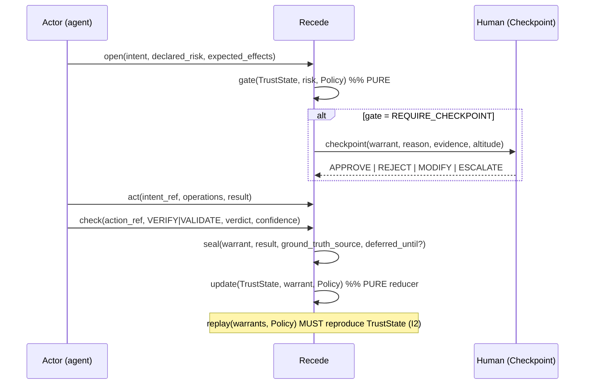

# Recede — Protocol Specification (v0.1, DRAFT)

Author: Yuval Raz · License: Apache-2.0 · Status: DRAFT, pre-1.0 (breaking changes expected)

> The key words MUST, MUST NOT, SHOULD, SHOULD NOT, and MAY are used as in RFC 2119.

## 0. Abstract

Recede is a language- and transport-agnostic protocol for **evidence-earned, risk-gated trust** between humans and AI agents. It defines *records, transitions, and invariants* — not an agent runtime, a storage engine, an ML model, or a UI. An agent's autonomy on a class of work is a **trajectory**: it accrues from confirmed good outcomes and is debited by failures, drift, and staleness. A **pure decision function** reads that trust plus the declared risk of the next action and decides whether a human checkpoint is required — so oversight **recedes** where evidence has accrued and **snaps back** on regression or novelty. Every claim is backed by an append-only, hash-linked evidence chain (a **Warrant**), making trust auditable and reconstructable rather than asserted.

## 1. Design goals & non-goals

**Goals.** (1) Trust with *memory* — carried forward per capability, not scored from zero each run. (2) *Proportional* human review — dialed down as evidence accrues, up on drift/novelty. (3) *Structural* auditability — any trust value reconstructable from its evidence. (4) A *layer*, not a platform — composes above interop (MCP/A2A), evals, and guardrails; consumes their signals as evidence.

**Non-goals (v0.1).** Cryptographic identity/PKI, ML scoring, distributed consensus, wire-encoding negotiation, human-facing web UI, multi-agent delegation, compliance-framework mapping, and any agent runtime. See §10.

## 2. Concepts

| Concept | One-line |
|---|---|
| **Actor** | Stably-identified participant (agent, flow, or human) with a role: EXECUTOR \| VERIFIER \| VALIDATOR \| HUMAN. |
| **TaskType** | A namespaced class of work carrying an intrinsic RiskClass. Trust scope is `(Actor, TaskType)`. |
| **Warrant** | The append-only, hash-linked evidence chain for one unit of work: Intent → Action → Check* → Outcome. |
| **Check** | A typed V&V step: VERIFY ("did it right") or VALIDATE ("did the right thing"), with verdict + confidence. |
| **TrustState** | Current `(Actor, TaskType)` standing: tier, score, confidence, sample_count. |
| **Gate** | Pure function: `(TrustState, risk, Policy) → REQUIRE_CHECKPOINT(altitude) \| AUTONOMOUS`. |
| **Checkpoint** | A dynamic human decision point; itself an evidence-bearing record. |
| **Policy** | Versioned, signed `(RiskClass × Tier) → gate` matrix + weighting/decay params + never-recede ceiling. |

## 3. Records (the wire-agnostic data model)

All records are **content-addressed**: `id = hash(canonical_serialize(record))`. `prev` links form the hash chain within one Warrant. A `sig` field is reserved (shape defined; crypto profile deferred, §10).

`canonical_serialize` MUST produce a deterministic byte string: object keys sorted lexicographically at every depth, no insignificant whitespace, `sha256` hex prefixed with `sha256:`, and the `id` and `sig` fields excluded from the pre-image. The canonical form **MUST omit any object key whose value is `null` or absent** — an explicit null, an absent optional, and a missing key all serialize identically (null array *elements* are preserved; only object keys are dropped). Two conformant implementations therefore agree on a record's `id` iff they agree on its non-null field values.

```
Record        = { id, kind, prev?, actor, ts, sig? }                       // base
IntentRecord  = Record & { task_type, inputs_digest, proposed_action, declared_risk, expected_effects }
ActionRecord  = Record & { intent_ref, operations[], result_digest }
CheckRecord   = Record & { action_ref, kind: VERIFY|VALIDATE, method, verdict: PASS|FAIL|INCONCLUSIVE, confidence, evidence_refs[] }
Outcome       = Record & { warrant_ref, result: SUCCESS|FAILURE|REVERTED|UNRESOLVED, ground_truth_source, deferred_until?, human_touched }
Checkpoint    = Record & { warrant_ref, reason, presented_evidence[], altitude, decision: APPROVE|REJECT|MODIFY|ESCALATE, reviewer, latency }

TrustState    = { scope: (actor, task_type), tier, score∈[0,1], confidence∈[0,1], sample_count, window_ref, updated }
Policy        = { id, version, matrix: (RiskClass, Tier) -> { gate: REQUIRE_CHECKPOINT(altitude) | AUTONOMOUS }, weights, decay, never_recede[] }
```

A **Warrant** is the ordered sequence `IntentRecord → ActionRecord → CheckRecord* → Outcome`, hash-linked and content-addressed. It gives tamper-evidence and a total order **without** mandating any specific ledger technology (the core requires only *append-only + hash-linked*, not global consensus).

## 4. Trust model

Trust is a value in `[0,1]` plus a **confidence** and a **sample_count**, held **per scope `(Actor, TaskType)`** and mapped onto ordered **TrustTiers** used by the Gate:

```
T0 UNTRUSTED   — no positive evidence; every action gated.
T1 OBSERVED    — accruing evidence; gated except on lowest RiskClass.
T2 SUPERVISED  — gated on high/critical risk only; low-risk autonomous.
T3 TRUSTED     — autonomous up to high risk; critical still gated.
T4 RELIED-UPON — autonomous incl. high risk; only irreversible/critical gated (never fully ungated — I3).
```

**Evidence → state.** State moves only via sealed Outcomes and Checkpoint decisions, folded through the Policy's weighting function (`update()`, §6). The trajectory is **asymmetric by design**:

- **Positive** (VERIFY+VALIDATE PASS, confirmed SUCCESS) raises score with diminishing returns and *raises confidence* as `sample_count` grows. A human **APPROVE** matching the agent's proposal is the strongest positive signal.
- **Negative** (FAILURE, REVERTED, or a Checkpoint **REJECT/MODIFY** contradicting the proposed action) lowers score **faster than success raises it**. A REVERTED outcome or a VALIDATE-FAIL MAY force a tier demotion regardless of prior score. A human **MODIFY** is scored as a VALIDATE-FAIL on the *original proposal* even if the final outcome succeeded — the agent proposed the wrong thing.
- **Confidence cap (I5).** The tier the Gate uses is the *lower* of (score-implied) and (confidence-implied) tier. High score on tiny sample cannot promote past T1 — one lucky run buys nothing.
- **Decay.** Score decays toward the tier floor over an idle window (staleness), and is discounted when the input distribution **drifts** from the evidence window that earned the trust. Decay MUST NOT cross a tier boundary silently without emitting a state-transition record.
- **Near-miss ratchet.** If a *receded* (autonomous) action is later spot-checked and a human overturns it, `update()` applies a heavy debit **and** re-tightens the Gate for that TaskType. This is the safety ratchet.
- **Cold start.** No history ⇒ conservative neutral prior at T0. Trust is opt-out-by-evidence, never opt-in-by-assertion.

## 5. The Gate (receding oversight)

```
gate(TrustState, declared_risk, Policy) -> { autonomous: bool, altitude?, reason }   // PURE
```

`gate` is a **pure function**: given the same trust state, risk, and Policy it MUST return the same decision, with **no side effects**. Because the Policy matrix maps `(RiskClass × Tier)` **monotonically** — higher tier and lower risk ⇒ less oversight — accumulating positive evidence **provably** moves a scope toward AUTONOMOUS, and negative evidence **provably** re-introduces checkpoints. Human review lands where `uncertainty × stakes` is highest, with `uncertainty ≈ (1 − confidence)` and `stakes ≈ RiskClass`: densest at new-agent/high-risk cells, thinning as either drops. Actions in the Policy `never_recede[]` set (irreversible / high-blast-radius / critical) retain a checkpoint at **every** tier (I3) — earned autonomy is bounded, never unbounded.

## 6. Lifecycle



Outcomes MAY be **deferred**: a chain sealed `UNRESOLVED` with a `deferred_until` window is re-sealed when ground truth arrives (e.g. a staging bake surfaces a regression and the merge is reverted, flipping SUCCESS → REVERTED), and `update()` re-folds it. This is how negative evidence only knowable later feeds back.

## 7. Invariants (normative MUSTs)

- **I1 — Scope isolation.** Trust is per `(Actor, TaskType)`; a score for one TaskType MUST NOT influence gating for another.
- **I2 — Reconstructability.** Every TrustState value MUST be reproducible by `replay()` from its referenced Warrants + Policy version. No unattributable trust.
- **I3 — Irreversible floor.** A RiskClass in the Policy `never_recede[]` set MUST retain a checkpoint at every tier. Trust bounds autonomy; it never removes the floor for irreversible harm.
- **I4 — Trust can decrease.** Any implementation that only accrues is **non-conformant**.
- **I5 — Confidence cap.** The confidence-implied tier MUST cap the score-implied tier (low sample ⇒ low autonomy).
- **I6 — Policy replay.** Every Gate decision MUST reference the exact Policy digest that produced it.
- **I7 — Gate purity.** `gate`, `update`, and `replay` MUST be free of observable side effects and deterministic in their inputs.

## 8. Trust threat model & anti-patterns

- **Trust theater.** Trust MUST move only on *closed* evidence (a confirmed Outcome or a Checkpoint decision). An action with no confirmed outcome moves nothing — no rubber-stamp can inflate trust.
- **Unbounded autonomy.** The `never_recede[]` ceiling (I3) + confidence cap (I5) + asymmetric penalty bound how far trust can carry an agent. Autonomy is earned *and bounded*.
- **Lucky-run promotion.** Prevented by I5.
- **Silent staleness.** Decay + drift discount ensure an agent must keep re-earning standing rather than coasting on old wins; decay crossing a tier boundary MUST emit a transition record.
- **One-score-fits-all.** Prevented by I1 (per-scope trust).

## 9. Conformance

**Normative core.** The normative surface an implementation MUST satisfy is: the eight operations (§ API) with `gate`/`update`/`replay` pure (I7); the record model and `canonical_serialize` of §3 (so record `id`s agree byte-for-byte); the invariants I1–I7; and the Gate's matrix semantics and monotonicity of §5. An implementation is **conformant** iff it meets all of these and passes the black-box `conformance/` suite.

**Weighting is a named reference profile.** The specific weighting arithmetic — the asymmetric accrual, the decay + drift relaxation, the near-miss ratchet, the tier floors, and the gate matrix constants — is **not** normative core. It is a versioned, named **reference profile**, `recede/ref-weighting-v0.1`. An implementation MAY substitute its own weighting profile provided the invariants (esp. I2, I4, I5) still hold.

**Cross-conformance.** Two implementations are **cross-conformant** iff, **under the same declared weighting profile**, they replay the same ordered Warrants to the same TrustState (score to `1e-9`, same tier, confidence, and sample_count) and derive the same record `id`s. This is not asserted, it is **demonstrated**: `conformance/vectors.json` fixes a policy and an ordered, explicitly-timestamped sequence of Warrants (covering accrual, recede, a `never_recede` gate, and a deferred REVERTED reseal) together with the expected final TrustState and the expected content-hash of a pinned record. Both reference implementations load that vector and MUST reproduce it exactly. A third implementation joins the conformance set by declaring `recede/ref-weighting-v0.1` and passing the same vector.

## 10. Deferred to profiles / later versions

Cryptographic identity/PKI/DIDs & signature suites (the `sig` shape is reserved); ML/statistical scoring beyond the reference weighting; distributed/multi-node ledgers & consensus; wire-encoding negotiation; human-facing web/Slack surfaces (the protocol defines `altitude` + `presented_evidence`; rendering is out); multi-agent delegation & cross-org trust portability; automated ground-truth discovery; compliance-framework mapping; economic/incentive layers.

## 11. Prior art & clean-room note

Designed from first principles and **public** prior art only: append-only/hash-linked logs and content addressing; risk matrices; calibration (confidence vs realized outcome); human-in-the-loop gating; verification-vs-validation from systems engineering; and the public agent-governance landscape (zero-trust promotion ladders, control/eval standards, reasoning-provenance record formats). Recede's ownable synthesis — trust as a *continuous, per-capability, machine-verifiable* quantity that makes review **recede** — is not covered by that prior art. No proprietary or employer-internal system, concept, or name is referenced.
